# 営業日報システム 要件定義

## 機能要件

### 1. ユーザー管理

- 営業と上長の2種類のロールを持つユーザーが存在する
- ログイン・認証機能を持つ

### 2. 日報作成（営業）

- 営業担当者が1日1件の日報を作成できる
- 日報には以下を記載する
  - **訪問記録**（複数行）：顧客マスタから顧客を選択し、訪問内容を記載
  - **Problem**：今の課題や上長への相談
  - **Plan**：明日やること
- 提出前は下書き保存できる

### 3. コメント機能（上長）

- 上長はProblem・Planそれぞれにコメントを投稿できる

### 4. マスタ管理

- **顧客マスタ**：会社名・担当者名・連絡先などを管理
- **営業マスタ**（ユーザー管理兼用）：氏名・所属・ロールなどを管理

---

## ER 図

```mermaid
erDiagram
    USERS {
        int user_id PK
        string name "氏名"
        string email
        string password_hash
        string role "営業 / 上長"
        string department "所属部署"
        datetime created_at
        datetime updated_at
    }

    CUSTOMERS {
        int customer_id PK
        string company_name "会社名"
        string contact_name "担当者名"
        string phone "電話番号"
        string address "住所"
        datetime created_at
        datetime updated_at
    }

    DAILY_REPORTS {
        int report_id PK
        int user_id FK "作成者"
        date report_date "日報日付"
        text problem "課題・相談"
        text plan "明日やること"
        string status "draft / submitted"
        datetime created_at
        datetime updated_at
    }

    VISIT_RECORDS {
        int visit_id PK
        int report_id FK
        int customer_id FK
        text visit_content "訪問内容"
        int visit_order "表示順"
        datetime created_at
        datetime updated_at
    }

    COMMENTS {
        int comment_id PK
        int report_id FK
        int commenter_id FK "コメント投稿者"
        string target_section "problem / plan"
        text comment_text
        datetime created_at
        datetime updated_at
    }

    USERS ||--o{ DAILY_REPORTS : "作成する"
    USERS ||--o{ COMMENTS : "投稿する"
    DAILY_REPORTS ||--o{ VISIT_RECORDS : "含む"
    DAILY_REPORTS ||--o{ COMMENTS : "受け取る"
    CUSTOMERS ||--o{ VISIT_RECORDS : "訪問される"
```

---

## テーブル設計の補足

| テーブル        | 役割                     | ポイント                                     |
| --------------- | ------------------------ | -------------------------------------------- |
| `USERS`         | 営業マスタ兼ユーザー認証 | `role` で営業/上長を区別                     |
| `CUSTOMERS`     | 顧客マスタ               | 訪問記録から参照される                       |
| `DAILY_REPORTS` | 日報本体                 | `user_id + report_date` でユニーク制約を推奨 |
| `VISIT_RECORDS` | 訪問記録（複数行）       | `visit_order` で入力順を保持                 |
| `COMMENTS`      | 上長コメント             | `target_section` でProblem/Planを区別        |
