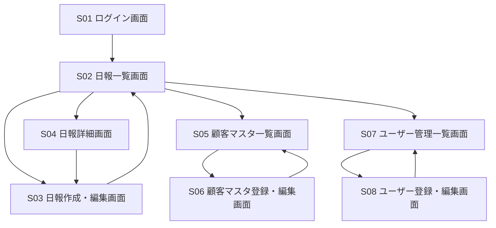

# 営業日報システム 画面定義書

## 画面一覧

| 画面ID | 画面名                   | アクセス権限           |
| ------ | ------------------------ | ---------------------- |
| S01    | ログイン画面             | 全員（未認証）         |
| S02    | 日報一覧画面             | 営業・上長             |
| S03    | 日報作成・編集画面       | 営業（自分の日報のみ） |
| S04    | 日報詳細画面             | 営業・上長             |
| S05    | 顧客マスタ一覧画面       | 営業・上長             |
| S06    | 顧客マスタ登録・編集画面 | 上長                   |
| S07    | ユーザー管理一覧画面     | 上長                   |
| S08    | ユーザー登録・編集画面   | 上長                   |

---

## 画面遷移図

---

## 各画面詳細

### S01 ログイン画面

**概要**：システムへのログインを行う画面。

**表示項目**

| 項目名         | 種別           | 備考 |
| -------------- | -------------- | ---- |
| メールアドレス | テキスト入力   |      |
| パスワード     | パスワード入力 |      |
| ログインボタン | ボタン         |      |

**操作・バリデーション**

- メールアドレス・パスワードは必須
- 認証失敗時はエラーメッセージを表示（「メールアドレスまたはパスワードが正しくありません」）
- ログイン成功後 → S02 日報一覧画面へ遷移

---

### S02 日報一覧画面

**概要**：日報の一覧を表示するメイン画面。営業は自分の日報のみ、上長は全員分を閲覧できる。

**表示項目**

| 項目名       | 種別     | 備考                         |
| ------------ | -------- | ---------------------------- |
| 日付         | テキスト |                              |
| 作成者名     | テキスト | 上長のみ表示                 |
| ステータス   | バッジ   | draft / submitted            |
| コメント有無 | アイコン | 未読コメントがある場合に表示 |
| 詳細ボタン   | ボタン   | S04へ遷移                    |

**操作**

| 操作           | 説明                                                            |
| -------------- | --------------------------------------------------------------- |
| 日報を作成する | S03（新規作成）へ遷移。当日分が未作成の場合のみ表示（営業のみ） |
| 詳細を見る     | S04 日報詳細画面へ遷移                                          |
| 絞り込み       | 日付範囲・作成者（上長のみ）・ステータスで絞り込み              |

---

### S03 日報作成・編集画面

**概要**：営業担当者が日報を作成・編集する画面。新規作成と編集で同一画面を使用する。

**表示項目**

| 項目名                | 種別             | 備考                    |
| --------------------- | ---------------- | ----------------------- |
| 日付                  | 日付表示         | 自動セット（変更不可）  |
| 訪問記録セクション    | -                | 複数行追加可能          |
| 　└ 顧客名            | セレクトボックス | 顧客マスタから選択      |
| 　└ 訪問内容          | テキストエリア   |                         |
| 　└ 行を追加ボタン    | ボタン           | 行を1件追加             |
| 　└ 行を削除ボタン    | ボタン           | 対象行を削除            |
| Problem（課題・相談） | テキストエリア   |                         |
| Plan（明日やること）  | テキストエリア   |                         |
| 下書き保存ボタン      | ボタン           | status=draft で保存     |
| 提出ボタン            | ボタン           | status=submitted で保存 |

**操作・バリデーション**

- 訪問記録は最低1行必須（提出時のみ）
- 顧客名は必須（行を追加した場合）
- 訪問内容は必須（行を追加した場合）
- Problem・Plan は任意（下書き保存時）、提出時は必須
- 提出済みの日報は編集不可（上長コメント後も同様）

---

### S04 日報詳細画面

**概要**：日報の内容を閲覧し、上長がコメントを投稿する画面。

**表示項目**

| 項目名                 | 種別           | 備考                            |
| ---------------------- | -------------- | ------------------------------- |
| 日付                   | テキスト       |                                 |
| 作成者名               | テキスト       |                                 |
| ステータス             | バッジ         |                                 |
| 訪問記録一覧           | テーブル       | 顧客名・訪問内容を行ごとに表示  |
| Problem                | テキスト       |                                 |
| 　└ コメント一覧       | テキスト       | 投稿者名・投稿日時・本文        |
| 　└ コメント入力欄     | テキストエリア | 上長のみ表示                    |
| 　└ コメント投稿ボタン | ボタン         | 上長のみ表示                    |
| Plan                   | テキスト       |                                 |
| 　└ コメント一覧       | テキスト       | 投稿者名・投稿日時・本文        |
| 　└ コメント入力欄     | テキストエリア | 上長のみ表示                    |
| 　└ コメント投稿ボタン | ボタン         | 上長のみ表示                    |
| 編集ボタン             | ボタン         | 作成者本人かつ draft 時のみ表示 |

**操作**

| 操作               | 権限             | 説明                                           |
| ------------------ | ---------------- | ---------------------------------------------- |
| コメントを投稿する | 上長             | Problem または Plan セクションにコメントを追加 |
| 編集する           | 営業（本人のみ） | S03 編集モードへ遷移（draft のみ）             |

---

### S05 顧客マスタ一覧画面

**概要**：登録済みの顧客を一覧表示・管理する画面。

**表示項目**

| 項目名     | 種別     | 備考         |
| ---------- | -------- | ------------ |
| 会社名     | テキスト |              |
| 担当者名   | テキスト |              |
| 電話番号   | テキスト |              |
| 住所       | テキスト |              |
| 編集ボタン | ボタン   | 上長のみ表示 |

**操作**

| 操作     | 権限 | 説明                       |
| -------- | ---- | -------------------------- |
| 新規登録 | 上長 | S06（新規作成）へ遷移      |
| 編集     | 上長 | S06（編集）へ遷移          |
| 検索     | 全員 | 会社名・担当者名で絞り込み |

---

### S06 顧客マスタ登録・編集画面

**概要**：顧客情報の登録・編集を行う画面。上長のみアクセス可能。

**表示項目**

| 項目名           | 種別         | バリデーション |
| ---------------- | ------------ | -------------- |
| 会社名           | テキスト入力 | 必須           |
| 担当者名         | テキスト入力 | 任意           |
| 電話番号         | テキスト入力 | 任意           |
| 住所             | テキスト入力 | 任意           |
| 保存ボタン       | ボタン       |                |
| キャンセルボタン | ボタン       | S05へ戻る      |

---

### S07 ユーザー管理一覧画面

**概要**：登録済みユーザーを一覧表示・管理する画面。上長のみアクセス可能。

**表示項目**

| 項目名         | 種別     | 備考        |
| -------------- | -------- | ----------- |
| 氏名           | テキスト |             |
| メールアドレス | テキスト |             |
| ロール         | バッジ   | 営業 / 上長 |
| 所属部署       | テキスト |             |
| 編集ボタン     | ボタン   |             |

**操作**

| 操作     | 説明                  |
| -------- | --------------------- |
| 新規登録 | S08（新規作成）へ遷移 |
| 編集     | S08（編集）へ遷移     |

---

### S08 ユーザー登録・編集画面

**概要**：ユーザー情報の登録・編集を行う画面。上長のみアクセス可能。

**表示項目**

| 項目名           | 種別             | バリデーション               |
| ---------------- | ---------------- | ---------------------------- |
| 氏名             | テキスト入力     | 必須                         |
| メールアドレス   | テキスト入力     | 必須・形式チェック・ユニーク |
| パスワード       | パスワード入力   | 必須（新規時）・8文字以上    |
| ロール           | セレクトボックス | 必須（営業 / 上長）          |
| 所属部署         | テキスト入力     | 任意                         |
| 保存ボタン       | ボタン           |                              |
| キャンセルボタン | ボタン           | S07へ戻る                    |
